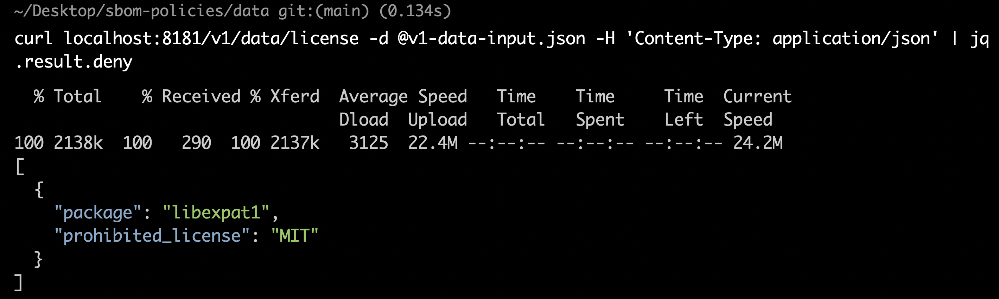
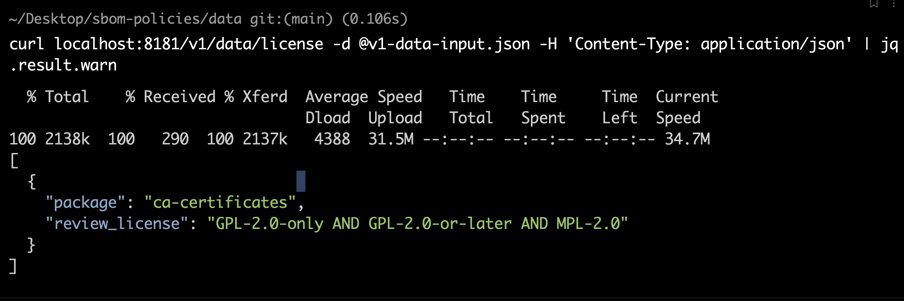
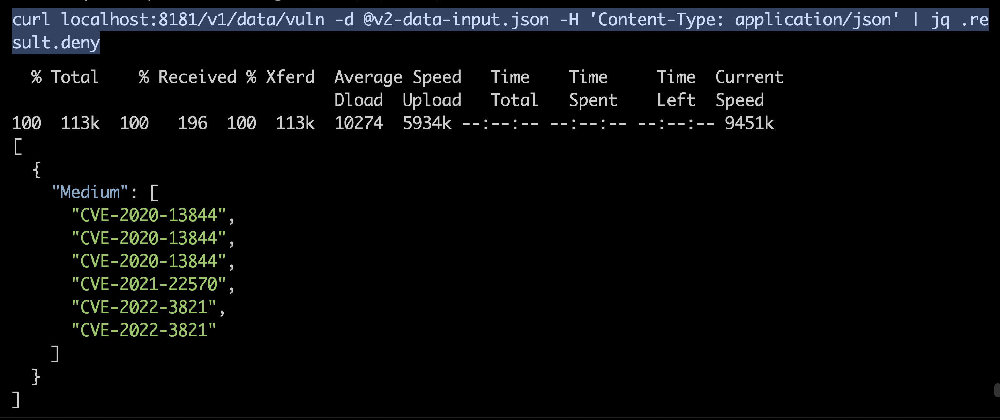

# SBOM policies

This repository contains a set of policies that can be used to make decisions based on SBOMs. The policies are written in Rego and enforced by [OPA](https://www.openpolicyagent.org/).

## Use cases:
- Block deployment if a component has a vulnerability with a certain severity. Also, supports allow-lists to ignore CVEs, if needed. 
- Block deployment if a component has a license that is not allowed. 

## How to use:
- Clone this repository
- Run server: `opa run --server policies/` 
- Open a different tab and run `cd data/`
- To check for prohibited licenses: `curl localhost:8181/v1/data/license -d @v1-data-input.json -H 'Content-Type: application/json' | jq .result.deny`

- To check for licenses that need to be reviewed: `curl localhost:8181/v1/data/license -d @v1-data-input.json -H 'Content-Type: application/json' | jq .result.warn`

- To check for vulnerabilities: `curl localhost:8181/v1/data/vuln -d @v2-data-input.json -H 'Content-Type: application/json' | jq .result.deny`

